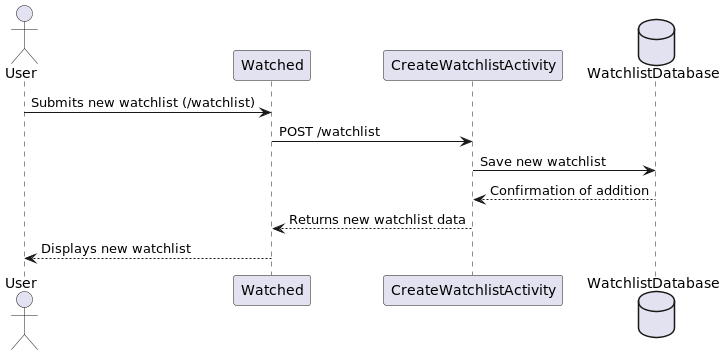

# Design Document - Watched Service Design

## 1. Problem Statement 

Watched is a streaming watchlist management service aiming to address the fragmented and inconvenient experience users 
face in managing their TV shows and movies across multiple streaming platforms. While various streaming services offer 
their own watchlist functionalities, users lack a centralized solution to organize, track, and update their content 
preferences effectively.

## 2. Top Questions to Resolve in Review
- What is the optimal user interface design to ensure intuitive navigation and ease of use for managing watchlist?
- How should we handle privacy and security concerns, especially regarding user data and authentication?


## 3. Use Cases
-  As a user, I want to create a new watchlist with a given name.
-  As a user, I want to retrieve my watchlist with a given ID.
-  As a user, I want to add TV shows and movies to my watchlist by specifying their titles and the streaming 
service they are available on.
-  As a user, I want to mark content as 'Watched' once I have viewed it to track my viewing progress.
-  As a user, I want to be able to add a show or movie to the end of the watchlist.
-  As a user, I want to be able to add a show or movie to the beginning of the watchlist. (Watch First) 
-  As a user, I want to be able to retrieve my 'Watched' list.
-  As a user, I want to be able to search my watchlist by title.
-  As a user, I want to be able to search my watchlist by streaming service. 

## 4. Project Scope

### 4.1 In Scope

- Developing a centralized watchlist service allowing users to add, organize, and update their content.
- Implementing features to mark content as 'Watched' and track viewing progress.

Extension (If time allows)
- Providing search and discovery functionalities to help users find specific titles on their watchlist.

### 4.2 Out of Scope

- Integration with streaming platforms' APIs for real-time availability.
- Social features like sharing watchlist or personalized recommendations based on viewing history.
- Ability to play content from the website.

## 5. Proposed Architecture Overview 

A serverless architecture using AWS services such as API Gateway, Lambda, DynamoDB, and Cognito for authentication. 
This architecture ensures scalability, cost-effectiveness, and easy maintenance. Data flow will be managed through 
RESTful APIs, facilitating communication between frontend clients and backend services.

## 6. API 

### 6.1 Public Models

```
// WatchlistModel

String id;
String title;
String userId;

```
```
// ContentModel

String contentId;
String watchlistId;
String title;
String userId;
String steamService;
Boolean watched;

```

### 6.2 Get Watchlist Endpoint

* Accepts `GET` request to `/watchlist/:id`
* Accepts a watchlist ID and returns the corresponding WatchlistModel.
    * If the given watchlist ID is not found, will throw a
      `WatchlistNotFoundException`

 

### 6.3 Create Watchlist Endpoint

* Accepts `POST` requests to `/watchlist`
* Accepts data to create a new watchlist with a provided name, a given user
  ID, and an optional list of tags. Returns the new watchlist, including a unique
  watchlist ID assigned by the Watchlist Service.
* For security concerns, we will validate the provided watchlist name does not
  contain any invalid characters: `" ' \`
    * If the watchlist name contains any of the invalid characters, will throw an
      `InvalidAttributeValueException`.



### 6.4 Update Watchlist Endpoint

* Accepts `PUT` requests to `/watchlist/:userId/update/:contentId`
* Accepts data to update the status of a content item on the watchlist for the user with the specified user ID.
    * If the watchlist ID is not found, will throw a `WatchlistNotFoundException`
* For security concerns, we will validate the provided watchlist name does not
  contain invalid characters: `" ' \`
    * If the watchlist name contains invalid characters, it will throw an
      `InvalidAttributeValueException`.


  
### 6.5 Add Content to Watchlist Endpoint:

* Accepts `POST` `/watchlist/:id/add`
* Accepts and adds a new content item to the watchlist for the user with the specified user ID.
* Accepts a watchlist ID and a content item to be added. 
* By default, will insert the new content to the end of the watchlist.
 - If the optional `queueNext` parameter is provided and is `true`, this API will insert the new show or movie to the 
front of the watchlist so that it will be the first title on the list.


### 6.6 Delete Watchlist Endpoint
Accepts `DELETE` `/watchlist/:id/delete`
User is able to delete a watchlist.
The webClient sends a DELETE request with watchlist id to DeleteWatchlist API endpoint.
If id does not exist, will throw `WatchlistNotFoundException`.
The API deletes info from dynamodb.
Client will show a successful delete message.

 

### 6.7 Get Watchlist Content Endpoint

* Accepts `GET` requests to `/watchlist/:id/content`
* Retrieves all content of a watchlist with the given watchlist ID
    * Returns the content list in default watchlist order.
   
* If the watchlist ID is found, but contains no content, the watchlist will be
  empty.
* If the watchlist ID is not found, will throw a `WatchlistNotFoundException`


### 6.8 Get Watchlists for User Endpoint

* Accepts `GET` requests to `/watchlists/:userId`
* Accepts a user ID and returns a list of  all WatchlistModels created by the user.
    * If the given customer has not created any watchlist, an empty list will be returned.


## 7. Tables

### 7.1. `watchlist`

```
id // partition key, string
title // string
userId // string, userId-watchlistId-index partition key

```
### 7.2. `content`

```
contentId // primary key, string
watchlistId // partition key, string
title // string
userId // string, userId-watchlistId-index partition key
streamServie // string
watched // boolean
```

- `usereId-watchlistId-index` includes ALL attributes 


## 8. Pages

Design Mockups

https://www.canva.com/design/DAGFRlda8uA/XhsCkvVT9aMLxSqpcmYZNw/view?utm_content=DAGFRlda8uA&utm_campaign=designshare&utm_medium=link&utm_source=editor
...

